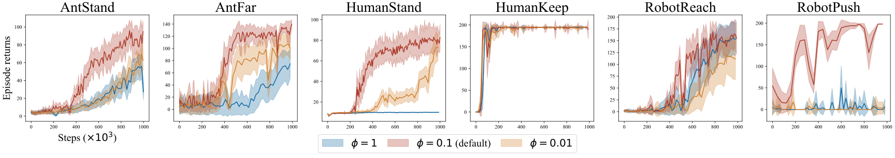

# Highly Efficient Self-Adaptive Reward Shaping for Reinforcement Learning (SASR)

The codes for our proposed **S**elf-**A**daptive **S**uccess **R**ate based reward shaping algorithm (SASR) for reinforcement learning to tackle the sparse-reward challenge.

[Paper Link]()

The principles of the SASR mechanism is shown as follows, inspired by the Thompson sampling, we use an evolving Beta distribution to sample estimated success rate for each state as the shaped reward.


## Requirements

- This code has been tested on:

```
pytorch==2.0.1+cu117
```

- Install all dependent packages:

```
pip3 install -r requirements.txt
```

## Run SASR Algorithm

Run the following command to run SASR algorithm on the task specified by `<Task ID>`:

```
python run-SASR.py --env-id <Task ID>
```

All available environments with sparse rewards evaluated in our paper are listed below:


* Mujoco-Sparse:
    - `MyMujoco/Ant-Height-Sparse`: the *AntStand* task.
    - `MyMujoco/Ant-Speed-Sparse`: the *AntSpeed* task.
    - `MyMujoco/Ant-Far-Sparse`: the *AntFar* task.
    - `MyMujoco/Ant-Very-Far-Sparse`: the *AntVeryFar* task.
    - `MyMujoco/Walker2d-Keep-Sparse`: the *WalkerKeep* task.
    - `MyMujoco/Humanoid-Keep-Sparse`: the *HumanKeep* task.
    - `MyMujoco/HumanoidStandup-Sparse`: the *HumanStand* task.
* Robotics-Sparse:
    - `MyFetchRobot/Reach-Jnt-Sparse-v0`: the *RobotReach* task.
    - `MyFetchRobot/Push-Jnt-Sparse-v0`: the *RobotPush* task.
* Classic control:
    - `MountainCarContinuous-v0`: the *MountainCar* task.

All hyper-parameters are set as default values in the code. You can change them by adding arguments to the command line. All available arguments are listed below:

```
--exp-name: the name of the experiment, to record the tensorboard and save the model.
--env-id: the task id
--seed: the random seed.
--cuda: the cuda device, default is 0, the code will automatically choose "cpu" if cuda is not available.
--gamma: the discount factor.

--pa-buffer-size: the buffer size to replay experiences.
--rb-optimize-memory: whether to optimize the memory
--batch-size: the batch size

--actor-lr: the learning rate of the actor
--critic-lr: the learning rate of the critic
--alpha: the alpha to balance the maximum entropy term
--alpha-autotune: whether to autotune the alpha, default is True
--alpha-lr: the learning rate of the alpha

--target-frequency: the target network update frequency
--tau: the tau for the soft update of the target network
--policy-frequency: the policy network update frequency

--total-timesteps: the total timesteps to train the model
--learning-starts: the burn-in period to start learning

--reward-weight: the weight factor of the shaped reward
--kde-bandwidth: the bandwidth of the kernel density estimation
--kde-sample-burnin: the burn-in period to sample the KDE
--rff-dim: the dimension of the random Fourier features, if set to None, then only use KDE (w/o RFF)
--retention-rate: the retention rate

--write-frequency: the frequency to write the tensorboard
--save-folder: the folder to save the model
```

## Experimental Results

- Learning performance in comparison with baselines:

We compared SASR with several baselines, including [ReLara](https://proceedings.mlr.press/v235/ma24l.html) (Ma et al., 2024) , [ROSA](https://ojs.aaai.org/index.php/AAAI/article/view/26371) (Mguni et al., 2023), [ExploRS](https://proceedings.neurips.cc/paper_files/paper/2022/hash/266c0f191b04cbbbe529016d0edc847e-Abstract-Conference.html) (Devidze et al., 2022), [#Explo](https://proceedings.neurips.cc/paper_files/paper/2017/hash/3a20f62a0af1aa152670bab3c602feed-Abstract.html) (Tang et al., 2017), [SAC](https://proceedings.mlr.press/v80/haarnoja18b) (Haarnoja et al., 2018), [TD3](https://proceedings.mlr.press/v80/fujimoto18a.html) (Fujimoto et al., 2018), [RND](https://arxiv.org/abs/1810.12894) (Burda et al., 2018) and [PPO](https://arxiv.org/abs/1707.06347) (Schulman et al., 2017), the results are shown as follows:


| Algorithms |   *AntStand*   |  *AntSpeed*   |    *AntFar*    |  *AntVeryFar*  |  *WalkerKeep*   |  *HumanStand*  |   *HumanKeep*   |  *RobotReach*   |   *RobotPush*    | *MountainCar* |
|:----------:|:--------------:|:-------------:|:--------------:|:--------------:|:---------------:|:--------------:|:---------------:|:---------------:|:----------------:|:-------------:|
|    SASR    | **39.12±2.86** | **0.94±0.07** | **73.92±4.97** | **78.64±3.92** | **158.24±5.59** | **42.63±2.17** | **180.98±4.40** |   81.29±6.52    | **137.06±12.66** |   0.91±0.04   |
|   ReLara   |   28.66±1.82   |   0.33±0.02   |   67.77±4.30   |   64.07±4.17   |   77.14±8.77    |   29.72±1.85   |   160.31±7.30   | **103.56±7.18** |    58.71±6.98    |   0.89±0.01   |
|    ROSA    |   3.80±0.03    |   0.02±0.00   |   4.71±0.28    |   0.64±0.07    |   32.14±1.19    |   8.55±0.03    |   152.38±4.98   |    0.27±0.03    |    0.00±0.00     |  -0.90±0.02   |
|  ExploRS   |   4.52±0.04    |   0.01±0.00   |   5.42±0.22    |   1.67±0.10    |    2.47±0.13    |   8.63±0.03    |   158.09±4.42   |    0.79±0.04    |    0.20±0.08     |  -0.99±0.02   |
|   #Explo   |   6.79±0.50    |   0.00±0.00   |   12.40±1.66   |   0.55±0.09    |   131.56±5.40   |   28.73±1.79   |   160.60±7.04   |    4.19±0.42    |    6.31±0.85     |   0.79±0.02   |
|    RND     |   4.23±0.03    |   0.02±0.00   |   6.66±0.25    |   1.00±0.09    |   44.78±1.39    |   8.67±0.03    |   159.79±4.27   |   28.18±2.53    |    0.04±0.04     | **0.94±0.00** |
|    SAC     |   15.93±0.69   |   0.00±0.00   |   9.64±0.57    |   20.73±2.87   |   70.96±8.10    |   9.31±0.05    |    4.59±0.84    |   45.03±4.92    |    0.55±0.21     |  -0.05±0.02   |
|    TD3     |   0.00±0.00    |   0.00±0.00   |   0.81±0.02    |   0.81±0.02    |   18.62±0.75    |   5.72±0.04    |    0.55±0.03    |    0.00±0.00    |    0.00±0.00     |   0.00±0.00   |
|    PPO     |   4.54±0.04    |   0.00±0.00   |   6.33±0.24    |   1.80±0.11    |   33.77±1.11    |   8.36±0.03    |  138.13±12.64   |   79.52±10.80   |    0.00±0.00     |   0.93±0.00   |

- *Ablation study #1*: SASR with or without the sampling process:


- *Ablation study #2*: SASR with different retention rates $\phi$:



- *Ablation study #3*: SASR with different bandwidths $h$ of Gaussian kernels:


- *Ablation study #4*: SASR with different bandwidths RFF feature dimensions $M$:


- *Ablation study #5*: SASR with different scales $\lambda$ of the shaped reward:


