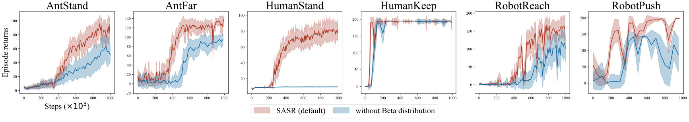

# Self-Adaptive Success Rate based Reward Shaping (SASR)

## Table of Contents

- [Requirements](#requirements)
- [Run SASR Algorithm](#run-sasr-algorithm)
- [Some Experimental Results](#some-experimental-results)

## Requirements

- This code has been tested on:
```
pytorch==2.0.1+cu117
```
- Install all dependent packages:
```
pip3 install -r requirements.txt
```

## Run SASR Algorithm

Run the following command to run SASR algorithm on the task specified by `<Task ID>`:

```
python run-SASR.py --env-id <Task ID>
```

All available environments with sparse rewards evaluated in our paper are listed below:


* Mujoco-Sparse:
    - `MyMujoco/Ant-Height-Sparse`: the *AntStand* task.
    - `MyMujoco/Ant-Far-Sparse`: the *AntFar* task.
    - `MyMujoco/Humanoid-Keep-Sparse`: the *HumanKeep* task.
    - `MyMujoco/HumanoidStandup-Sparse`: the *HumanStand* task.
* Robotics-Sparse:
    - `MyFetchRobot/Reach-Jnt-Sparse-v0`: the *RobotReach* task.
    - `MyFetchRobot/Push-Jnt-Sparse-v0`: the *RobotPush* task.

All hyper-parameters are set as default values in the code. You can change them by adding arguments to the command line. All available arguments are listed below:

```
--exp-name: the name of the experiment, to record the tensorboard and save the model.
--env-id: the task id
--seed: the random seed.
--cuda: the cuda device, default is 0, the code will automatically choose "cpu" if cuda is not available.
--gamma: the discount factor.

--pa-buffer-size: the buffer size to replay experiences.
--rb-optimize-memory: whether to optimize the memory
--batch-size: the batch size

--actor-lr: the learning rate of the actor
--critic-lr: the learning rate of the critic
--alpha: the alpha to balance the maximum entropy term
--alpha-autotune: whether to autotune the alpha, default is True
--alpha-lr: the learning rate of the alpha

--target-frequency: the target network update frequency
--tau: the tau for the soft update of the target network
--policy-frequency: the policy network update frequency

--total-timesteps: the total timesteps to train the model
--learning-starts: the burn-in period to start learning

--reward-weight: the weight factor of the shaped reward
--kde-bandwidth: the bandwidth of the kernel density estimation
--kde-sample-burnin: the burn-in period to sample the KDE
--rff-dim: the dimension of the random Fourier features
--retention-rate: the retention rate

--write-frequency: the frequency to write the tensorboard
--save-folder: the folder to save the model
```

## Some Experimental Results

The saved experimental results can be found in [this folder](./Experiments/exp-data). You can run the following command to plot the experimental results:

- To evaluate the learning performance in comparison with baselines:
```
python ./Experiments/comparison.py
```


- *Ablation study #1* To compare SASR with or without the sampling process:

```
python ./Experiments/without-sampling.py
```



- *Ablation study #2* To compare SASR with different retention rates:

```
python ./Experiments/retention-rate.py
```


- *Ablation study #3* To compare SASR with different scales of the shaped reward:

```
python ./Experiments/reward-weight.py
```


